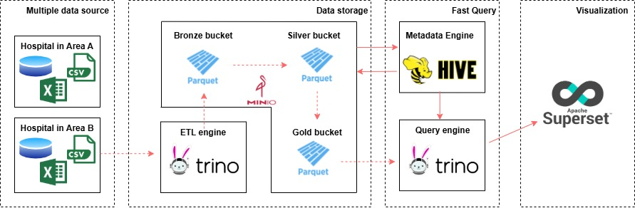

# Mass Healthcare Analytics with Fast Distributed SQL Query Engine (Trino) and Big Data Business Intelligence (Apache Superset)

This project is a **Big Data healthcare analytics system** designed to analyze large-scale, distributed healthcare data using a centralized data lake and schema-on-read analytics, instead of traditional ETL-heavy data warehouses.

---

## Project Scope

The project explores a modern healthcare analytics architecture where:
- Data is generated across multiple hospitals
- Schemas are heterogeneous and subject to privacy constraints
- Analytics are performed directly on a centralized data lake using distributed SQL
- Business insights are delivered through BI dashboards

---

## System Architecture

The system adopts a **centralized data lake architecture** with **distributed querying and visualization**.

  

**Architecture highlights:**
- **Data sources**: Multiple hospitals exporting CSV/Excel data
- **Storage**: MinIO (S3-compatible) with Bronze–Silver–Gold layers (Parquet)
- **Metadata**: Hive Metastore
- **Query engine**: Trino (schema-on-read)
- **Visualization**: Apache Superset

**The full system consists of three main layers:**
1. Dataset & Datasource layer  
2. Distributed SQL query layer  
3. Analytics & BI layer  

> ⚠️ *Note:* This repository does **not** contain the full system implementation.  
> It focuses on the **Dataset & Datasource layer**, which was my responsibility in the group project.

---

## My Contribution  
**Role: Data Preparation & Dataset Engineering**

This repository documents **my individual contribution**, focusing on the **Dataset & Datasource layer** of the system.

### Responsibilities
- Selected a suitable healthcare dataset (**Synthea**) for large-scale analytics
- Prepared **6 core Synthea tables**:  
  `patients`, `encounters`, `conditions`, `procedures`, `medications`, `organizations`
- Designed and implemented a **multi-node data architecture** by partitioning the dataset into **8 hospital nodes** based on organization and city mapping
- Simulated **real-world data source challenges**, including:
  - Schema heterogeneity (add/drop/rename columns, format drift)
  - Privacy constraints (masking, partial exports, missing values)
- Exported **analytics-ready Parquet datasets** to support downstream distributed SQL queries

This work provides the foundation for the distributed querying and BI components implemented by other team members.

---

## Dataset

- **Synthea Synthetic Patient Records (MITRE)**
- Privacy-safe synthetic healthcare data  
- Dataset link: https://synthea.mitre.org/downloads/

Large raw datasets and full node-level outputs are intentionally **not included** in this repository.

---

## Notes

- This is a **group Big Data mini-project** (HCMUT Master Program).
- This repository focuses **only on the data preparation & dataset engineering component**.
- Distributed SQL querying (Trino) and BI dashboards (Apache Superset) were implemented by other team members.
